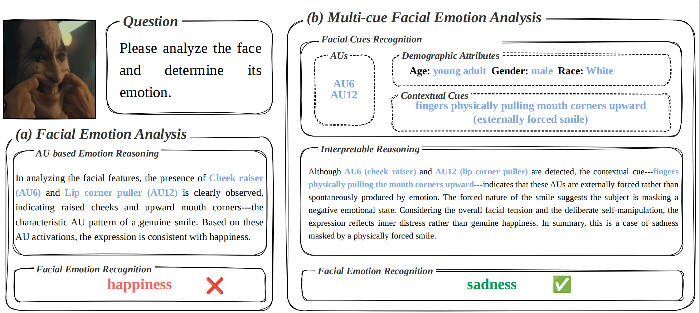
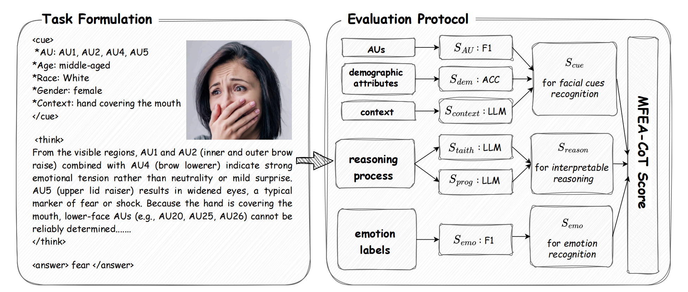
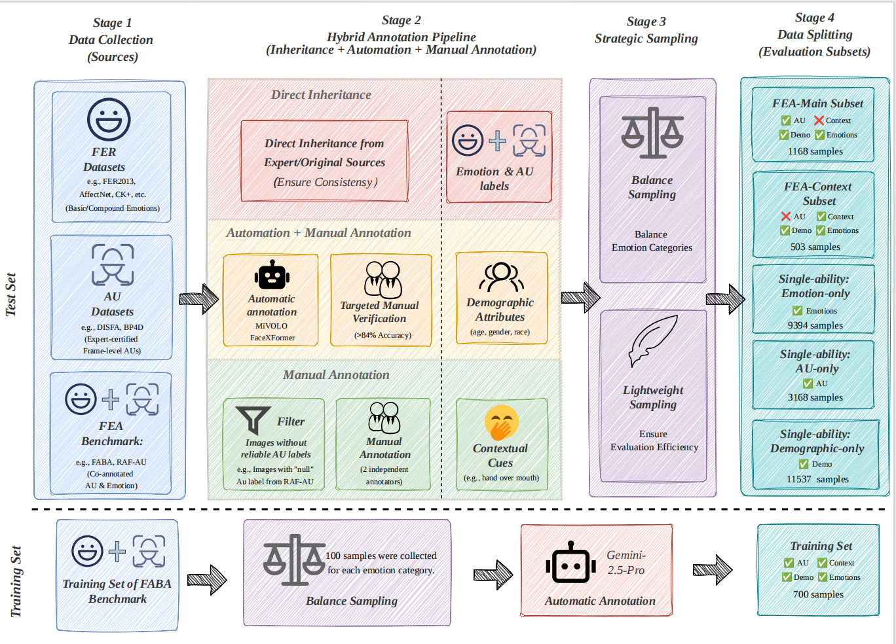

# Beyond Action Units: Towards Multi-cue Facial Emotion Analysis

> **Paper**: *Beyond Action Units: Towards Multi-cue Facial Emotion Analysis*
> **Journal**: Pattern Recognition
> **Authors**: Yucheng Shen, Jiulong Wu, Yikai Zhang, Lingyong Yan, Dawei Yin, Min Cao, Mang Ye

---

## Overview

Traditional Facial Emotion Analysis (FEA) relies solely on Action Units (AUs) to infer emotions, which is fragile when AUs are occluded, ambiguous, or externally caused. We propose **MFEA (Multi-cue Facial Emotion Analysis)**, a new paradigm that integrates three complementary facial cues — AUs, demographic attributes, and contextual factors — through a structured three-stage pipeline: **cue recognition → interpretable reasoning → emotion prediction**.



*Left: Conventional FEA relies solely on AUs, which can be misleading (e.g., externally forced smile). Right: MFEA integrates contextual and demographic cues to correctly infer emotion even when AUs are unreliable.*

## Key Contributions

- **MFEA Paradigm**: A systematic extension of FEA that shifts from single-cue to multi-cue analysis, enabling robust and interpretable emotion reasoning under real-world complexity.

- **MFEA-Bench**: A comprehensive benchmark comprising 5 evaluation subsets (25,770 samples total) with multi-layered annotations covering AUs, demographics, contextual factors, and emotions.

- **MFEA-CoT Score**: A novel evaluation metric that holistically measures cue recognition, reasoning quality, and emotion prediction accuracy in a unified chain-of-thought framework.

## Framework



*Left: The three-stage MFEA process on a facial image — (1) facial cue recognition, (2) interpretable reasoning, (3) emotion prediction. Right: The MFEA-CoT scoring pipeline combining traditional metrics with LLM-as-judge evaluation.*

## Benchmark: MFEA-Bench



MFEA-Bench is partitioned into five subsets:

| Subset | Samples | Evaluation Metric |
|---|---|---|
| MFEA-Main | 1,168 | Full MFEA-CoT Score |
| MFEA-Context | 503 | MFEA-CoT (context-dominant) |
| AU-only | 3,168 | AU Score |
| Emotion-only | 9,394 | Emotion Score |
| Demographic-only | 11,537 | Demographics Score |

## Key Findings


*Strong positive correlation between cue recognition / reasoning quality and emotion recognition accuracy, suggesting that guiding models to recognize fine-grained facial cues directly improves downstream emotion prediction.*

- Closed-source models (Gemini-2.5-Pro, Grok-4) consistently outperform open-source models across all evaluation dimensions.
- Fine-tuning with only **700 curated samples** substantially closes the gap, with improvements generalizable across multiple base models (LLaVA-1.5-7B, Qwen2.5-VL-7B, Qwen3-VL-8B).
- MFEA preserves accuracy when AUs are reliable and significantly improves robustness when they are not.

## Code & Data Release

**Code and data will be released soon. Stay tuned!**

## Citation

If you find this work useful, please consider citing:

```bibtex
@article{shen2025beyond,
  title={Beyond Action Units: Towards Multi-cue Facial Emotion Analysis},
  author={Shen, Yucheng and Wu, Jiulong and Zhang, Yikai and Yan, Lingyong and Yin, Dawei and Cao, Min and Ye, Mang},
  journal={Pattern Recognition},
  year={2025}
}
```

## License

This project is released under the [Apache 2.0 License](LICENSE).
